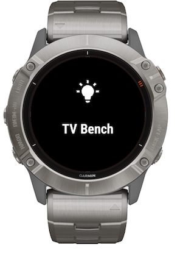

## HassControl

A garmin widget to interact with [Home Assistant](https://www.home-assistant.io/).

The widget aims to be simplistic but still provide the most basic functionality, such as triggering scenes or toggling lights and switches.

Due to limitations by both Garmin and Apple/Android some setup steps will be more cumbersome than what I would have preferred.

Please read through the instructions below, I will try to guide you through the steps :)

- [HassControl](#hasscontrol)
  - [Prerequisites](#prerequisites)
  - [Installation](#installation)
  - [Configuration](#configuration)
  - [Logging in](#logging-in)
  - [Group sync](#group-sync)

### Prerequisites
In order to use this widget you need to have an Home Assistant instance accessible over https.

As all communication from Garmin watches go thru the mobile device, you also need to have a paired mobile phone, and the Garmin Connect app needs to be running on that phone.

As soon as you get out of range from the phone or closes the app the widget will stop functioning.

### Installation
The easiest way to install the app is to download and install the [ConnectIQ app](https://support.garmin.com/en-US/?faq=mmm2rz2WBI3zbdFQYdiwX8) from Garmin on your smartphone.

Once you have the app installed on your paired phone you can browse for widget and find the app by name, [HassControl](https://apps.garmin.com/en-US/apps/47f64742-cf59-4d54-b368-841a347f7c6d).

### Configuration
Open the widget settings in the ConnectIQ app.
[How to Access the Settings of a Connect IQ App Using the Garmin Connect App](https://support.garmin.com/en-US/?faq=SPo0TFvhQO04O36Y5TYRh5)

**Host**: This should be the url to the Home Assistant instance you would like to control.

**Scenes**: Since scene names aren't that configurable in Home Assistant you can override the names in this box. Multiple overrides can be specified by separating them with a comma (,).

So for example; If you have the scene `scene.good_bye` and `scene.movie` the configuration string could look like this: `good_bye=Good Bye, movie=Movie`, or `good_bye, movie`.

You can also use this field to "import" scenes if you don't want to create a group in Home Assistant as described below.

**Group**: In this box you can write a single group from Home Assistant, this group can then be used from within the widget to import all entities contained in that group.

I will describe this procedure in more detail below.

### Logging in
Once you have configured all settings in the ConnectIQ app, the next step will be to login.

Since the watch doesn't have an suited interface for logging in to web pages, the login will be performed with the help of your paired smartphone.

Before you get started, make sure that you have installed and paired your watch in the [Garmin Connect](https://connect.garmin.com/start/) app.

If you don't have push notifications turned on, make sure the app is running before proceeding.

To login, simply open the widget and trigger any scene. Shortly after, you will see a sign in request on your smartphone. Complete the sign in process on your phone and return to the watch.

You should now be able to trigger your scenes.

If you don't have any scenes, you can login by hold the menu button on your watch and logging in from them widget menu.

If you don't see any login request on your phone. Restart the widget after you have opened the garmin Connect app and the watch has been connected.

### Group sync
Due to the limitations of the watch, there is no really good way of listing and adding entities directly from the watch.
But the easiest way to add your entities is by [creating a new group](https://www.home-assistant.io/integrations/group/) in Home Assistant, and add all your entities there.

Then configure the group you just added in the ConnectIQ settings as described [above](#configuration).

Once you have added the group in settings, open the widget and the menu. Then go into settings and select `refresh entities`.
Once that is done, all entities added to that group in Home Assistant will be imported and available on the watch.

At any time, you can repeat this procedure to add, update or remove entities from your watch.
